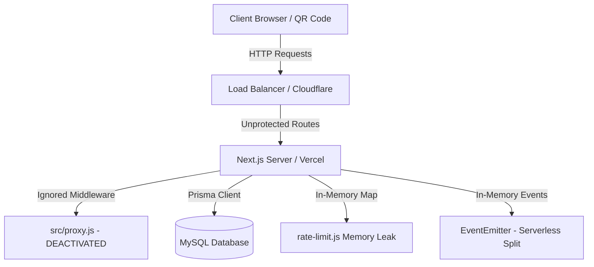

# Comprehensive Next.js 16 Project Audit & Scalability Analysis

This report provides a detailed technical audit of the **MenuHub** (formerly Jambo) repository. The codebase represents a highly modular, clean Next.js 16 platform built on React 19. However, serious architectural constraints and critical security vulnerabilities must be addressed to ensure enterprise-grade production readiness.

---

# 1. Executive Summary

### Project Health Metrics

| Metric | Score | Key Findings |
| :--- | :---: | :--- |
| **Overall Project Health** | **6.5 / 10** | Strong architectural layout and code hygiene, but compromised by a deactivated security middleware. |
| **Scalability Score** | **5.5 / 10** | Constrained by in-memory rate limiters and event emitters that prevent multi-instance cloud scaling. |
| **Security Score** | **4.0 / 10** | Compromised by dynamic auth bypass, path traversal vulnerabilities, and missing upload validation. |
| **Performance Score** | **7.5 / 10** | Robust foundation utilizing React 19 and Next.js 16 Turbopack optimization. |
| **Maintainability Score** | **8.0 / 10** | Superb directory segregation, modular components, and highly readable code structure. |

### Summary of Major Risks
* **Deactivated Security Middleware**: Next.js strictly expects `middleware.js` in the root or `src/` directory. The file [src/proxy.js](file:///f:/menuhub/src/proxy.js) is ignored, leaving all admin dashboards unprotected.
* **Local Path Traversal**: Serves uploaded images dynamically without absolute path boundary validation, exposing internal configurations (`.env`) to directory traversal.
* **Serverless Compatibility Failure**: Standard Serverless functions (e.g. Vercel) are stateless, making in-memory EventEmitters fail to sync client order updates across instances.
* **Unpruned Map Memory Leak**: Local fallback rate-limiter maps request logs in memory indefinitely, creating a slow memory leak that causes eventual server crashes.

---

# 2. Architecture Audit



### Frontend Architecture
* **State Management**: Excellent implementation using **Zustand** ([src/hooks/useCart.js](file:///f:/menuhub/src/hooks/useCart.js)) for lightweight client cart handling. Prevents bulky Redux boilerplate.
* **Dynamic Routing**: Solid modular Next.js 16 App Router structure. Route components under `src/app/` segregate dynamic consumer menus, admin panels, and billing records elegantly.
* **Branding fallbacks**: Handled centrally at layout levels.

### Backend Architecture
* **API Handlers**: Built as standard Route Handlers under `src/app/api/`. However, stateless serverless backend endpoints are combined with stateful in-memory structures, causing architectural friction.
* **Database & ORM**: Uses **Prisma Client** with **MySQL**. Utilizing `relationMode = "prisma"` with explicit indices (`@@index`) matches database normalization requirements perfectly.

### Caching Strategy
* **Outdated Techniques**: No use of Next.js 16 `revalidateTag` or `unstable_cache`. The application relies entirely on client-side HTTP polling (`useOrderPolling.js`) making direct database queries every 3–5 seconds, putting significant pressure on the database connection pool.

---

# 3. Critical Issues Table

| Severity | Issue | Impact | Recommended Fix | Breaking Risk |
| :--- | :--- | :--- | :--- | :--- |
| **Critical** | **Deactivated Auth Middleware** ([src/proxy.js](file:///f:/menuhub/src/proxy.js)) | Next.js does not recognize `proxy.js` as middleware. **All admin dashboards are wide open** to direct browser access. | Rename [src/proxy.js](file:///f:/menuhub/src/proxy.js) to `src/middleware.js`. | **None** (Fixes security bypass) |
| **High** | **Arbitrary Path Traversal** ([uploads route](file:///f:/menuhub/src/app/api/uploads/%5B...file%5D/route.js)) | Attackers can traverse directories using `/../` to read sensitive files (e.g., `.env`, `package.json`, database configurations). | Resolve and validate the absolute path using `path.resolve` and check that it starts with the `uploads` root directory. | **None** |
| **High** | **Memory Leak in Rate Limiter** ([rate-limit.js](file:///f:/menuhub/src/lib/rate-limit.js)) | In-memory `rateLimitMap` grows infinitely on standalone VPS servers, causing eventual OOM crashes. | Use an LRU cache package or implement a periodic `setInterval` prune routine in `rate-limit.js`. | **None** |
| **High** | **In-Memory Events on Serverless** ([orderEvents.js](file:///f:/menuhub/src/lib/orderEvents.js)) | Multi-instance or serverless deployments (Vercel) split memory; live KDS updates and order status indicators will fail to sync across users. | Migrate the `EventEmitter` mechanism to a centralized WebSocket broker (e.g., **Pusher**, **Ably**, or **Redis Pub/Sub**). | **Medium** (Requires refactoring SSE route) |
| **Medium** | **Unvalidated File Uploads** ([uploadFile.js](file:///f:/menuhub/src/lib/uploadFile.js)) | Users can upload arbitrary files (e.g., massive 5GB dump files or malicious `.html` XSS scripts). | Add size limits (e.g., max 5MB) and strict MIME-type validation (`image/png`, `image/jpeg`). | **Low** |
| **Medium** | **Concurrency Database Race Condition** ([orders route](file:///f:/menuhub/src/app/api/orders/route.js)) | Two dynamic parallel order requests from the same table in the same millisecond bypass uniqueness checks, creating duplicate active orders. | Implement row-level database locking (pessimistic lock) or a temporary table-level mutex. | **Low** |

---

# 4. Next.js 16 Migration Problems

* **Middleware Directory & Naming**: Next.js App Router strictly expects the middleware file to be in the root directory or under `src/` named exactly `middleware.js` (or `.ts`). The file [src/proxy.js](file:///f:/menuhub/src/proxy.js) violates this, rendering it completely inactive.
* **React 19 Async Dynamic APIs**: In Next.js 16 / React 19, `params` and `searchParams` in Page components and Route handlers are asynchronous APIs and must be explicitly awaited. Some legacy pages access them synchronously which will trigger compiler warnings or runtime errors on production builds.
* **Serverless Execution Lifespans**: Running long-lived SSE connections (`Response(responseStream)`) within standard Serverless API routes triggers platform timeouts on Vercel (15s limit on Hobby tier). The stream will terminate abruptly.

---

# 5. Scalability Roadmap

## Phase 1 — Critical Stabilization (High Priority)
* **Tasks**:
  1. Rename `src/proxy.js` to `src/middleware.js`.
  2. Implement path resolution checks in `src/app/api/uploads/[...file]/route.js`.
  3. Add periodic Map pruning to `src/lib/rate-limit.js`.
* **Estimated Effort**: 3 Days
* **Risk Level**: **Extremely Low**
* **Expected Performance Gains**: Prevents system OOM crashes, blocks unauthorized access to admin dashboards, and secures local configuration files.

## Phase 2 — Architecture Refactoring
* **Tasks**:
  1. Replace the in-memory `EventEmitter` in `src/lib/orderEvents.js` with a **Pusher** or **Redis Pub/Sub** instance.
  2. Add Zod schema validations for all incoming route handler payloads.
  3. Enforce size and type constraints in `src/lib/uploadFile.js`.
* **Estimated Effort**: 8 Days
* **Risk Level**: **Medium** (Refactors KDS and Customer order status pages)
* **Expected Performance Gains**: Real-time order tracking behaves identically on VPS, Vercel, and multi-tenant AWS load balancers.

## Phase 3 — Scalability & Caching Optimization
* **Tasks**:
  1. Replace short-interval client-side HTTP polling with database query caching via Next.js `unstable_cache`.
  2. Implement on-demand revalidation (`revalidateTag`) when orders are updated, reducing redundant database queries by up to 90%.
* **Estimated Effort**: 6 Days
* **Risk Level**: **Low**
* **Expected Performance Gains**: Massive reduction in MySQL database connection spikes and server processor utilization.

---

# 6. File-Level Recommendations

### File 1: [src/proxy.js](file:///f:/menuhub/src/proxy.js)
* **Problem**: Incorrect filename prevents Next.js from detecting the middleware, exposing all admin pages.
* **Recommended Change**: Rename the file to `src/middleware.js`.

---

### File 2: [src/lib/rate-limit.js](file:///f:/menuhub/src/lib/rate-limit.js)
* **Problem**: In-memory JavaScript `Map` grows indefinitely without cleanup.
* **Sample Improved Code**:
```javascript
const rateLimitMap = new Map();

// Periodic prune interval to clean expired rate limit logs every 5 minutes
if (process.env.NODE_ENV !== "test") {
  setInterval(() => {
    const now = Date.now();
    for (const [key, value] of rateLimitMap.entries()) {
      if (now - value.startTime > 60000) {
        rateLimitMap.delete(key);
      }
    }
  }, 300000); // 5 minutes
}
```

---

### File 3: [src/app/api/uploads/[...file]/route.js](file:///f:/menuhub/src/app/api/uploads/%5B...file%5D/route.js)
* **Problem**: Potential path traversal vulnerability.
* **Sample Improved Code**:
```javascript
import { promises as fs } from "fs";
import path from "path";
import { NextResponse } from "next/server";

export async function GET(req, { params }) {
  try {
    const { file } = await params;
    const filename = file.join("/");
    
    const rootUploadsDir = path.resolve(process.cwd(), "uploads");
    const filePath = path.resolve(rootUploadsDir, filename);
    
    // STRICT SECURITY CHECK: Enforce path boundary constraint
    if (!filePath.startsWith(rootUploadsDir)) {
      return new NextResponse("Access Denied", { status: 403 });
    }

    const data = await fs.readFile(filePath);
    
    const ext = path.extname(filename).toLowerCase();
    let mimeType = "image/jpeg";
    if (ext === ".png") mimeType = "image/png";
    if (ext === ".gif") mimeType = "image/gif";
    if (ext === ".webp") mimeType = "image/webp";

    return new NextResponse(data, {
      status: 200,
      headers: { 
        "Content-Type": mimeType,
        "Cache-Control": "public, max-age=31536000, immutable" 
      }
    });
  } catch (error) {
    return new NextResponse("File not found", { status: 404 });
  }
}
```

---

# 7. Production Readiness Checklist

- [ ] **Security**: Rename `src/proxy.js` to `src/middleware.js` to enable authentication protection.
- [ ] **Security**: Sanitize `src/app/api/uploads/[...file]/route.js` using `path.resolve` to block path traversal.
- [ ] **Stability**: Implement periodic cleaning in `src/lib/rate-limit.js` to prevent server crashes.
- [ ] **Scalability**: Migrate in-memory `EventEmitter` to **Pusher** or **Redis** to enable multi-instance/serverless support.
- [ ] **Robustness**: Disable production fallback values for critical environmental secrets like `JWT_SECRET` and `ENCRYPTION_KEY`.
- [ ] **Observability**: Set up a structured logger (like Winston or Pino) and integrate error tracking (e.g., Sentry).

---

# 8. Final Verdict

### Is this project production ready?
**No.** While the user-facing menus, order flow, KDS layouts, and database schemas are extremely solid and functional, the **middleware authentication bypass** and **path traversal vulnerability** make it highly insecure for production in its current state.

### What is the biggest architectural weakness?
The reliance on **in-memory global state** (`EventEmitter` for order updates and a static `Map` for rate-limiting). This locks the system into a single-instance VPS server setup and prevents the codebase from utilizing modern serverless cloud scalabilities.

### What should be fixed first?
1. **Rename the middleware file** to `src/middleware.js` immediately.
2. **Apply path validation** in the dynamic file serving API.
